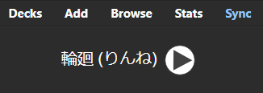
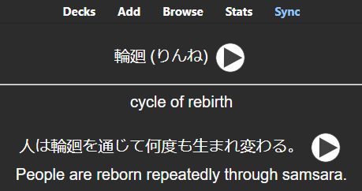

# Chapter 6: Flashcard Construction and Anki Injection

This chapter covers the final two modules in the pipeline before orchestration: `flashcard.py`, which assembles the outputs of all prior stages into Anki-compatible card fields, and `anki_connect.py`, which delivers the finished card and its media files into Anki. These two modules are covered together because they are tightly coupled by Anki's data model, how the flashcard is constructed depends entirely on how Anki expects to receive and render it.

## Anki's Data Model

Before looking at the code, it is worth understanding how Anki organizes information. Anki's terminology is specific and the distinctions matter for implementation.

### Notes, Cards, and Decks

A note is a collection of fields, a unit of information. A card is a unit of review, what actually appears during study. A note type (also called a "model") defines which fields a note has and how those fields are rendered into cards.

The `Basic` note type, which ships with every Anki installation, has two fields: `Front` and `Back`. It produces one card per note: the front is shown as the prompt, the back is revealed as the answer. More complex note types can produce multiple cards from a single note (e.g., a `Basic (and reversed card)` type produces both a front→back card and a back→front card from the same fields).

A deck is a collection of cards used for organizing study sessions. The tool puts all cards in a deck called "Japanese," configurable via `config.py`.

We work at the note level, not the card level. AnkiConnect's `addNote` action creates a note, and Anki automatically generates the corresponding card(s) based on the note type. For the `Basic` type, one note produces one card.

### Field Content

Fields contain text, optionally with HTML formatting. Anki's card templates render field content inside HTML, so any valid HTML in a field is interpreted. This means:

- `<br>` produces a line break
- `<b>bold</b>` produces bold text
- `[sound:filename.mp3]` is a special Anki tag that embeds an audio player

Plain text (without HTML tags) is rendered as-is. Fields do not support Markdown.

### Media References

Audio and image files are referenced by name using Anki's bracketed tag syntax:

```
[sound:食べる_word.mp3]
```

When Anki renders a field containing this tag, it looks for a file named `食べる_word.mp3` in the profile's media folder. The path is never part of the tag, Anki's media folder is flat, and all references are by bare filename.

This tag syntax is not HTML. It is Anki-specific markup that the card renderer processes before generating the final HTML. The tag is replaced with an `<audio>` element or a play button, depending on the platform and Anki version.

## flashcard.py: Assembling the Card

### What It Receives

`build_flashcard` is the convergence point of the pipeline. It takes three arguments, each from a different upstream stage:

- `vocab_info`: from the retrieval module (Chapter 3): the word, readings, meanings, kanji info
- `llm_output`: from the generative module (Chapter 4): example sentence, translation, concise gloss
- `audio_paths`: constructed in `main.py` from the TTS module's output (Chapter 5): file paths and filenames for both audio files

This is the first and only point in the pipeline where all three data sources are visible simultaneously.

### Implementation

```python
def build_flashcard(vocab_info: dict, llm_output: dict, audio_paths: dict) -> dict:
    """Combine all data into a flashcard dict with front and back fields."""
    word = vocab_info["word"]
    reading = ", ".join(vocab_info["readings"]) if vocab_info["readings"] else ""
    meaning = llm_output["vocab_translation"]
    example = llm_output["example_sentence"]
    example_translation = llm_output["example_sentence_translation"]

    word_audio_tag = f'[sound:{audio_paths["word_filename"]}]' if audio_paths.get("word_filename") else ""
    sentence_audio_tag = f'[sound:{audio_paths["sentence_filename"]}]' if audio_paths.get("sentence_filename") else ""

    front = f"{word} ({reading}) {word_audio_tag}".strip()

    back_parts = [
        meaning,
        "",
        f"{example} {sentence_audio_tag}".strip(),
        example_translation,
    ]
    back = "<br>".join(back_parts)

    return {
        "front": front,
        "back": back,
        "audio_paths": audio_paths,
    }
```

### Front Field Construction

```python
front = f"{word} ({reading}) {word_audio_tag}".strip()
```

The front of the card shows three things:

1. The word in its written form (kanji): `食べる`
2. The reading in parentheses (kana): `(たべる)`
3. An audio tag for the word's pronunciation: `[sound:食べる_word.mp3]`

For the input 食べる, the front field contains:

```
食べる (たべる) [sound:食べる_word.mp3]
```

When Anki renders this, the learner sees the word and its reading as text, with an audio play button. The `.strip()` handles the edge case where audio is absent, without it, a trailing space would remain.

The front includes the reading. In a more advanced flashcard design, you might hide the reading on the front (to test recall) and reveal it on the back. The `Basic` note type does not support that kind of conditional display. If you want that behavior, you would create a custom note type with separate fields for word, reading, and audio, and use card templates to control visibility. The current design prioritizes simplicity over pedagogical nuance.

### Back Field Construction

```python
back_parts = [
    meaning,
    "",
    f"{example} {sentence_audio_tag}".strip(),
    example_translation,
]
back = "<br>".join(back_parts)
```

The back of the card is built from a list of strings joined with `<br>` (HTML line break). The result for 食べる might look like:

```html
to eat<br><br>彼は毎日ご飯を食べます。 [sound:食べる_sentence.mp3]<br>He eats rice every day.
```

Here is what an actual generated card looks like in Anki (for the word 輪廻):





The empty string `""` in `back_parts` produces a blank line (an extra `<br>`) between the meaning and the example sentence. This visual separation helps the learner distinguish the definition from the contextual example.

The structure places the concise meaning first (from the LLM's `vocab_translation`), then the example sentence with audio, then the English translation. This ordering is intentional: the meaning is the most important piece of information on the back, and it should be the first thing the learner sees when flipping the card.

### The Output Dict

```python
return {
    "front": front,
    "back": back,
    "audio_paths": audio_paths,
}
```

The function returns a dict with three keys. `front` and `back` are strings ready to be inserted into Anki's `Front` and `Back` fields. `audio_paths` is passed through unchanged from the input, the flashcard module does not use the file paths itself, but the AnkiConnect module needs them to upload the audio files.

This pass-through is a deliberate design choice. The flashcard dict is self-contained: it carries everything the AnkiConnect module needs to fully create the note (field content *and* media files). The alternative, having `main.py` pass audio paths separately to `add_note()`, would work but would split related information across two arguments for no reason.

### No External Dependencies

`flashcard.py` imports nothing. No standard library modules, no third-party packages, no `config.py`. It is a pure data transformation: three dicts go in, one dict comes out. This makes it trivial to test in isolation, you can call `build_flashcard()` with hand-crafted dicts and inspect the result without any services running.

## anki_connect.py: Delivering to Anki

### The AnkiConnect Protocol

[AnkiConnect](https://foosoft.net/projects/anki-connect/) exposes Anki's functionality through a JSON-over-HTTP API on `localhost:8765`. Every request follows the same format:

```json
{
    "action": "actionName",
    "version": 6,
    "params": { ... }
}
```

Every response follows the same format:

```json
{
    "result": ...,
    "error": null
}
```

If the action succeeds, `result` contains the return value and `error` is `null`. If it fails, `result` is `null` and `error` contains a string describing what went wrong.

The `version` field is a protocol version number. Version 6 is the current version of the AnkiConnect API. Including it ensures that request and response formats match what the code expects. If the installed AnkiConnect version does not support version 6, it returns an error.

### The Request Helper

```python
def _invoke(action: str, **params) -> dict:
    """Send a request to AnkiConnect."""
    payload = {"action": action, "version": 6, "params": params}
    try:
        resp = requests.post(config.ANKI_CONNECT_URL, json=payload, timeout=10)
        resp.raise_for_status()
    except requests.ConnectionError:
        raise ConnectionError(
            "Cannot connect to AnkiConnect. "
            "Is Anki open with the AnkiConnect add-on installed?"
        )
    result = resp.json()
    if result.get("error"):
        raise RuntimeError(f"AnkiConnect error: {result['error']}")
    return result["result"]
```

`_invoke` is the internal function that all AnkiConnect operations go through. It handles three concerns:

**1. Request construction.** The `**params` syntax collects keyword arguments into a dict. This means callers can write `_invoke("createDeck", deck="Japanese")` instead of `_invoke("createDeck", params={"deck": "Japanese"})`. The keyword arguments map directly to the AnkiConnect action's parameter names.

**2. Connection errors.** A `requests.ConnectionError` means Anki is not running or the AnkiConnect add-on is not installed. This is the most common error users encounter, and the error message tells them exactly what to check. The timeout is 10 seconds, AnkiConnect operations are local and should respond within milliseconds, so a 10-second timeout is generous while still preventing indefinite hangs.

**3. Application errors.** AnkiConnect returns errors in-band (status 200, error in the JSON body) rather than using HTTP status codes. The `if result.get("error")` check catches these, for example, attempting to add a duplicate note, referencing a nonexistent note type, or providing invalid field names. These are raised as `RuntimeError` with the AnkiConnect error message included.

### Ensuring the Deck Exists

```python
def ensure_deck_exists(deck_name: str) -> None:
    """Create the deck if it doesn't already exist."""
    _invoke("createDeck", deck=deck_name)
```

AnkiConnect's `createDeck` action is idempotent, if the deck already exists, it returns the existing deck's ID without error. This means we can call it unconditionally before every note insertion without checking whether the deck is already there.

This is called inside `add_note()`, not in `main.py`. The deck's existence is a precondition for note insertion, and coupling the check to the insertion keeps the precondition close to the operation that depends on it.

### Storing Media Files

```python
def _store_media(filepath: str, filename: str) -> None:
    """Store an audio file in Anki's media folder via AnkiConnect."""
    with open(filepath, "rb") as f:
        data = base64.b64encode(f.read()).decode("utf-8")
    _invoke("storeMediaFile", filename=filename, data=data)
```

AnkiConnect cannot read files from arbitrary paths on your filesystem. To get an audio file into Anki's media folder, you must send the file's contents as a base64-encoded string in the API request. This function:

1. Opens the file in binary mode and reads its entire contents
2. Base64-encodes the binary data, producing an ASCII string
3. Sends the encoded string to AnkiConnect along with the target filename

AnkiConnect's `storeMediaFile` action writes the decoded data to Anki's media folder using the provided filename. If a file with that name already exists, it is overwritten.

The base64 encoding inflates the data size by approximately 33% (3 bytes of binary become 4 bytes of base64). For a typical MP3 file of a short Japanese sentence (~50–100 KB), the encoded payload is ~70–140 KB. This is well within reasonable HTTP request sizes.

Note that `filepath` and `filename` are different values. `filepath` is the local path where the TTS module wrote the file (e.g., `audio/食べる_word.mp3`). `filename` is the name under which the file should be stored in Anki's media folder (e.g., `食べる_word.mp3`). The distinction exists because Anki's media folder is flat, there is no `audio/` subdirectory inside it.

### Adding the Note

```python
def add_note(flashcard: dict) -> int:
    """Add a note to Anki and store associated audio files."""
    ensure_deck_exists(config.ANKI_DECK_NAME)

    # Store audio files in Anki's media folder
    audio_paths = flashcard.get("audio_paths", {})
    if audio_paths.get("word_path"):
        _store_media(audio_paths["word_path"], audio_paths["word_filename"])
    if audio_paths.get("sentence_path"):
        _store_media(audio_paths["sentence_path"], audio_paths["sentence_filename"])

    note = {
        "deckName": config.ANKI_DECK_NAME,
        "modelName": config.ANKI_NOTE_TYPE,
        "fields": {
            "Front": flashcard["front"],
            "Back": flashcard["back"],
        },
        "options": {
            "allowDuplicate": False,
        },
    }

    return _invoke("addNote", note=note)
```

`add_note` is the module's public function. It performs three operations in sequence:

**1. Ensure the deck exists.** Idempotent, as discussed above.

**2. Upload media files.** Both audio files are uploaded before the note is created. This ordering matters, if the note were created first, Anki would render the `[sound:]` tags immediately but find no corresponding files, resulting in a briefly broken card. By uploading the media first, the files are in place by the time the note references them.

The `.get()` checks on `audio_paths` handle the case where audio generation was skipped or failed. If a path key is missing or empty, the corresponding upload is skipped. The `[sound:]` tags in the card fields would also be empty (handled by `build_flashcard`), so the card simply has no audio rather than broken audio references.

**3. Create the note.** The note dict follows AnkiConnect's `addNote` specification:

- `deckName`: which deck to add the note to
- `modelName`: which note type to use (determines the available fields)
- `fields`: a dict mapping field names to content strings
- `options.allowDuplicate`: when `False`, AnkiConnect rejects a note if a note with identical `Front` field content already exists in the deck

The function returns the note ID: an integer that uniquely identifies the note in Anki's database. `main.py` prints this as confirmation.

### Duplicate Prevention

```python
"options": {
    "allowDuplicate": False,
},
```

Setting `allowDuplicate` to `False` means AnkiConnect will return an error if you try to add a note with a `Front` field that matches an existing note. This prevents accidentally creating duplicate flashcards when running the tool for the same word twice.

The duplicate check is based on field content, not the original word input. If you add a card for 食べる, then modify the code to change the front format (e.g., removing the reading), the new front field content is different and AnkiConnect will allow the second note. Duplicate detection is simple string equality on the first field, not semantic deduplication.

If AnkiConnect rejects a duplicate, it returns the error `"cannot create note because it is a duplicate"`. This propagates through `_invoke` as a `RuntimeError` and is caught by `main.py`.

## The Two Modules Together

The separation between `flashcard.py` and `anki_connect.py` mirrors a common pattern in systems that produce and deliver content: one module formats the data, another module delivers it to the target system. They could be merged into a single module, but the separation has benefits:

- `flashcard.py` can be tested without Anki running. You can call `build_flashcard()` with mock data and inspect the output strings to verify formatting.
- `anki_connect.py` can be reused for other purpose, any code that needs to interact with Anki can import it independently of the flashcard formatting logic.
- The flashcard format can be changed without touching the delivery code, and vice versa.

The data flow between them is one-way and simple: `build_flashcard()` produces a dict, `add_note()` consumes it.

## What Gets Sent to Anki

For the input word 食べる, after all pipeline stages complete, AnkiConnect receives four API calls:

**1. Create deck** (if needed):
```json
{"action": "createDeck", "version": 6, "params": {"deck": "Japanese"}}
```

**2. Store word audio:**
```json
{"action": "storeMediaFile", "version": 6, "params": {
    "filename": "食べる_word.mp3",
    "data": "SUQzBAAAAAAAI1RTU0UAAA..."
}}
```

**3. Store sentence audio:**
```json
{"action": "storeMediaFile", "version": 6, "params": {
    "filename": "食べる_sentence.mp3",
    "data": "SUQzBAAAAAAAI1RTU0UAAA..."
}}
```

**4. Add note:**
```json
{"action": "addNote", "version": 6, "params": {"note": {
    "deckName": "Japanese",
    "modelName": "Basic",
    "fields": {
        "Front": "食べる (たべる) [sound:食べる_word.mp3]",
        "Back": "to eat<br><br>彼は毎日ご飯を食べます。 [sound:食べる_sentence.mp3]<br>He eats rice every day."
    },
    "options": {"allowDuplicate": false}
}}}
```

Four HTTP requests to localhost, all completing in milliseconds. The result is a fully formed flashcard in Anki with two embedded audio files, ready for the next review session.
